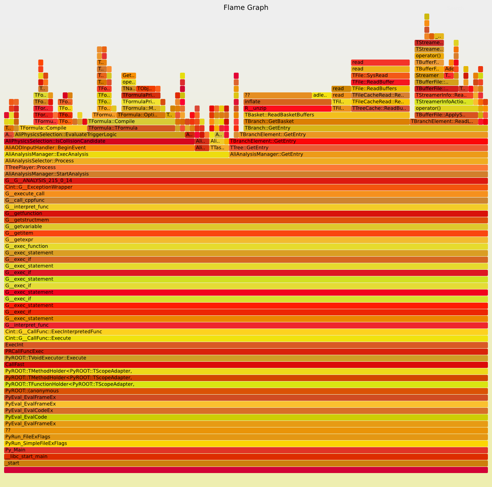

.. image:: https://badge.fury.io/py/nittygriddy.svg
    :target: https://badge.fury.io/py/nittygriddy

	     
============
Nittygriddy
============

Nitty griddy aims to make the deployment of analyses using the Aliroot/Aliphysics framework easy, transparent, and reproducible.
The primary goal is to completely eliminate the ungodly practice of copy-pasting together ``run.C`` files from all over the place.
A nittygriddy "project" requires the user to only provide the settings for the specific analysis they want to run - nothing related to how or where you would like to run your analysis.
The way these settings are supplied is analogous to how one configures a LEGO train.
The deployment in ``local`` (sequential), ``proof lite`` (local parallel) or ``grid`` is then completely transparent and does not require the editing of any files.
Nittygriddy also makes it easy to download parts of a desired dataset for local *offline* development - no need for running grid test mode.
On top of that, nittygriddy makes it easy to trigger the merging process once a grid analysis is finished.

And last but not least, nittygriddy does not do a "vendor lock-in": nittygriddy produces straight forward ``run.C`` files, stores them in a tidy folder structure and enables you to always rerun your analysis without nittygriddy in the future with a simple ``root run.C``.

.. image:: https://imgs.xkcd.com/comics/standards.png

Disclaimer
==========
I am using nittygriddy daily for quite a while now and find it to be extremely helpful. I think/hope that it could also be a great tool for others. I will try hard to keep the current API stable, but if needed, I might have to make some breaking changes, which might need minor actions from the users. But as I said earlier, if that were to happen and you don't want to use nittygriddy anymore, you can always use the generated ``run.C`` files independently. If you have issues with nittygriddy, would love to see datasets added, or have any other comments and suggestions it is best to open an issue here on github or create a pull request straight away. See more on how to contribute at the bottom of this document.

Installing nittygriddy
======================

Nittygriddy is available on `pypi`. Thus installation is easily done with `pip`, but first you should make sure that the stuff you install with `pip` will later be avialble on the command line. Add this to your `.bashrc` or similar: ::

  # .bashrc or similar
  export PYTHONUSERBASE=$HOME/.local_pip
  export PATH=$PYTHONUSERBASE/bin:$PATH

This will make everything installed as unprivileged user with `pip --user` go
under `PYTHONUSERBASE`. Now you can run: ::

  pip install --user nittygriddy

Which installes nittygriddy into your home directory. The command ``nitty`` should now be avialable on the command line, along with its hopefully helpful ``--help``.

Using nittygriddy for the impatient
===================================
Don't wanna read instructions? This is how you start an analysis on local data::

  $ alien-token-init <your-cern-user-name>
  $ nitty datasets --download LHC15o_pass1_HIR 1  # Download 1GB of the specified dataset
  $ nitty new my-analysis    # Create an example analysis folder (runs AliMultSelectionTask)
  $ cd my-analysis
  $ # Run the analysis of this folder on the LHC15o dataset locally
  $ nitty run local LHC15o_pass1_HIR
  $ ls ./latest/  # marvel at the resulting AnalysisResults.root file
    

Setting up a "train" folder
===========================

What I call a "train" in the following is really nothing more than a folder where you store the settings for a specific analysis. An analysis usually consists of several task (e.g. ``AliMultSelectionTask`` and your own task). Currently, all the settings are in one single file (``ConfigureTrain.C``) which make any folder a "train folder". Also, note that in order to use nittygriddy **your task must be present in your local aliphysics installation** (which it really should anyways)!

`ConfigureTrain.C`
------------------
The only ``.C`` file needed. It reflects setting up the options for your task analog to what is done in the lego trains. Note that this file will be compiled and therefore has to be valid cpp (thus all the ``#includes`` in the example below). The reason for this is that using the interpreter is just plain evil and will lead to undefined behavior and sad users eventually. The shortest possible version, would look something like this:

.. code-block:: cpp

    #include "TROOT.h"
    #include "AliVEvent.h"
    #include "AliBasedNdetaTask.h"

    void ConfigureTrain() {
      // Load you AddTask macro
      gROOT->LoadMacro("$ALICE_PHYSICS/PWGLF/FORWARD/analysis2/AddTaskdNdeta.C");
    
      // Execute your AddTask macro. You can pass options in the function call if necessary
      AliBasedNdetaTask* task =
        reinterpret_cast< AliBasedNdetaTask* > (gROOT->ProcessLine("AddTaskdNdeta()"));
      
      /*
        Set your task's options here:
        task->SelectCollisionCandidates(AliVEvent::kMB);
      */
    }

..
   nittygriddy.json *(Not used, yet)*
   ----------------------------------
   This file contains some default options as well as depedencies which need to be loaded for execution. Again, this is analogus to the lego train interface. An example file might look like: ::

     [
       {
	   "Dependencies":"libOADB.so libSTEERBase.so libAOD.so libANALYSISalice.so libPWGCFCorrelationsC2.so"
       }
     ];
..

`nitty_datasets.yml`
--------------------
This file contains information about custom datasets. If the standard ones are used this is not necessary. The file should be located in your home directory at `~/nitty_datasets.yml`. The file has to be in `Yaml` formating. A typical entry looks like this:

.. code-block:: yaml

  LHC15o_pass1_HIR_FMD:
    data_pattern: pass1/AOD/*/AliAOD.root
    datadir: /alice/data/2015/LHC15o/
    datatype: aod
    is_mc: 'false'
    notes: 5.02 TeV, Good runs with FMD, ITS, and V0. This is not the full run list
      since it requires the FMD!
    run_list: 246980, 246865, 246809, 246808, 246766, 246765, 246763, 246759, 246676,
      246675, 246495, 246493, 246276, 246275, 246225, 246185, 246153, 246089, 246052,
      245963, 245954, 245833, 245705, 245683
    run_number_prefix: '000'
    system: PbPb

  LHC15f_AOD171_FMD:
  ...
    
Note that `Yaml`, just like Python, is indention based. But don't worry, if the syntax is faulty, nittygriddy will complain. This includes missing fields in each entry. Datasets which are defined in `nitty_datasets.yml` will be merged with the default ones which come with nittygriddy.

Using Nittygriddy
=================

I'm lost. Note that ``--help`` is also available for each subcommand::

  $ nitty --help

Create a new train folder. I.e. create a new folder with a minimal working ``ConfigureTrain.C``::

  $ nitty new a_new_train
  
List all avialable datasets::

  $ nitty datasets -l

Search all datasets for something (e.g. the collsions system)::

  $ nitty datasets -s PbPb

Show details about a dataset::

  $ nitty datasets --show LHC10h_AOD160

Download 5GB of data from the given dataset for offline developing.
The files are saved in ``~/lhc_data/`` following the same folder structure as on the grid::

  $ nitty datasets --download LHC10h_AOD160 5

Run your analysis in proof lite locally::

  $ nitty run lite LHC10h_AOD160

Or submit it to the grid using a PARfile (see below)::
    
  $ nitty run grid LHC10h_AOD160 --par_files="PWGCFCorrelationsC2.par"

Once your analysis is finished on the grid, change to the output dir (``latest`` is a link pointing to the latest thing nittygriddy started) and trigger the merging::
    
  $ cd latest
  $ nitty merge online

Once all the final merging stages are reached, you can merge individual runs offline on your own computer::
    
  $ nitty merge offline

There are many more things you can do. Just check ``--help``.

Tips and Tricks
===============

PARfiles
--------
Par files can be used if you latest changes to your task are not yet in the latest aliphysics tag.
See Dario's `page <https://dberzano.github.io/2015/01/29/parfiles-reloaded>`_ for a bit more background. Long story short, if your task is properly set up in AliPhysics, you should be able to do::

  $ cd $ALICE_PHYSICS/../build
  $ make PWGCFCorrelationsC2.par # you can use TAB completion to find the right par file
  $ make -j$MJ install

This should create the .par file for your analysis in ``$ALICE_PHYSICS/PARfiles``. If you get an error instead, you might not have your analysis set up properly in cmake. Dario's post should have you covered.

My analysis crashes miserably when running in Proof lite
--------------------------------------------------------
Proof lite is quite picky about initializing your task's members in the constructors. This makes it a great test for running on the grid, but the error message is rather cryptic. Check if you initialized all your members in the constructor.

I get a crash if I do something grid related
--------------------------------------------
Do you have a valid alien-token? Its on the todo-list to ask for it more gracefully if its not present.

Migrate to LEGO trains
----------------------
Once your analysis works, you should be able to almost seamlessly use your ``ConfigureTrain.C`` content in the LEGO wagon setup. Please use LEGO-trains whenever possible and reasonable to save resources!

Debug your code like a boss (with GDB)
--------------------------------------
There was a talk at one of the ALICE weeks about using GDB for debugging `(link) <https://indico.cern.ch/event/463952/>`_.
Unfortunately, the talk did not cover how to use GDB with your task in aliphysics.
Nittygriddy makes this quite easy now with the ``--wait_for_gdb`` option::

  $ nitty run local LHC10h_AOD160 --wait_for_gdb

The above sets up your analysis, prints out its process id (eg. 27575) and then waits for you to attach gdb. In principle it should be as easy as::

  $ gdb -p 27575

But there might be a few caveats. I wrote a small blog post about how to use gdb `here <http://cbourjau.github.io/alice/aliroot/aliphysics/2015/12/17/Debugging_aliphysics.html>`_.

Profile your code
-----------------

Nittygriddy makes it easy to use ``gdb`` as a stochastic profiler. This means that the running analysis is interuped many times, and a statistic is made where the analysis spends most of its time. This kind of profiling can be very visualized in so called "Flame Graphs". Nittygriddy packages some of the files from the original [FlameGraph project](https://github.com/adam-p/markdown-here/wiki/Markdown-Cheatsheet#links) to make this process as easy as possible and this is how.

First, you have to start a local analysis. You probably want to start it with the ``--wait_for_gdb`` flag to get the ``pid``, but you can also just find the ``pid`` any other way, if you prefer::

  $ nitty run local LHC10h_AOD160 --wait_for_gdb

Now, you have to open a second terminal where you attach the profiler to the ``pid`` of the running analysis (e.g. 27575)::

  $ nitty profile 27575 --nsamples=100

Remember to resume the analysis in the first terminal! Now you can use your browser to check out the flamegraph. For the above ``pid`` it would be at ``/tmp/27575.svg``. The ``svg`` is updated every 5 samples, so give it some time!

An example of a flamegraph might then look something like this:

What is happening behind the scene?
===================================

When running your analysis nitty griddy create a new folder in your train folder.
It then generates a ``run.C`` file from your options and copies it into that folder.
This ``run.C`` can be run on independently and should be easy to read.
This has the advantage that you can always just stop using ``nittygriddy`` and drop back to modifying the macros yourself - no vendor lockin!
However, if you would like to continue using ``nittygriddy``, you should not edit those macros directly since they might get overwritten and it defeats the purpose of this program in the first place.

Contributing
============
Contributions of any kind (issues, pull requests, general comments...) are always welcome! If you would like to hack on nittygriddy (for example to add new datasets to the default ones) you should check out nitty griddy as an editable python package: ::

  $ git clone https://github.com/cbourjau/nittygriddy.git
  $ cd nittygriddy
  $ pip install -e .

This installs nittygriddy in ``editable`` mode, meaning that any changes to the files in the repository clone are immediately available to the command line tool without re-installation. This means that updates can be raked in with a simple ``git pull origin/master``.
